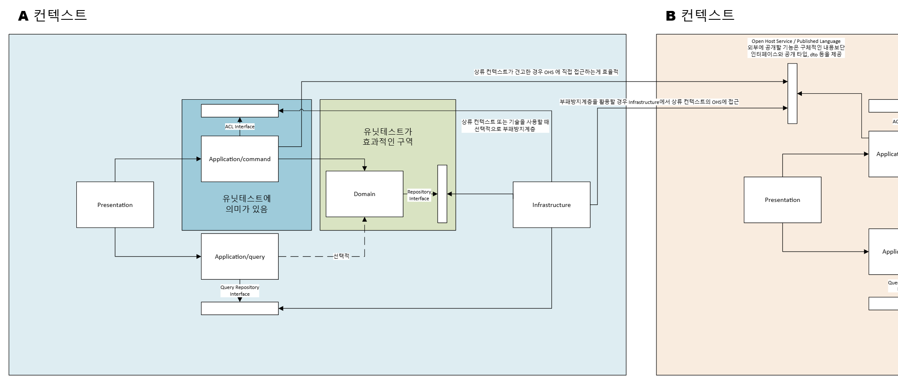

# pragmatic-ddd-monolith

> **단일 배포 모놀리식**에서 DDD를 실용적으로 빌려 설계하는 **원칙 중심** 스킬.
> 구조를 강제하지 않고, 왜 의존을 단방향으로 두고 읽기/쓰기를 가르고 계약 경계를 두는지 **원칙과 근거**를 제시합니다.
> 객체지향 + DI 프레임워크(Spring Boot, NestJS, .NET 등)에서 두루 쓸 수 있습니다.
> 모듈을 따로 배포하지 않습니다(그건 MSA). 정석 DDD를 교조적으로 따르기보다 생산성과의 타협을 우선합니다.



## 설치

```bash
npx skills add dev-goraebap/pragmatic-ddd-monolith
```

## 무엇을 하는가

두 가지 경계(**컨텍스트**와 **레이어**)를 명확히 나누고, 컨텍스트 간 의존을 단방향으로 다스리는 **원칙**을 제시합니다. 구체 명명·구조·코드는 정하지 않습니다.

- **두 경계** — 비즈니스 영역(컨텍스트)과 한 컨텍스트 내부의 기술 책임(레이어)을 섞지 않습니다.
- **의존 방향** — 컨텍스트 내부는 안쪽(도메인)을 향하고, 컨텍스트 간은 단방향만 허용합니다.
- **CQS** — 쓰기 경로(도메인으로 불변식 검증)와 읽기 경로(화면용 읽기 전용 모델)를 분리합니다.
- **컨텍스트 간** — 하류 → 상류 단방향, 하류는 상류의 **공개 계약**(OHS + PL)만 참조. 하류는 **Conformist**(직접 수용) 또는 **ACL**(자기 포트 + 번역 어댑터)을 선택합니다.
- **도메인** — 순수성·의존성 격리·자가검증을 지킵니다.
- **결정은 ADR로** — 패키지/명명·컨텍스트 경계·Conformist vs ACL·ORM 정책 등 구체 결정은 각 팀이 **ADR로 기록**합니다.

구성:

- [SKILL.md](./SKILL.md) — 본체(철학·전제·두 경계·의존 방향·CQS·도메인 원칙·상하류·공개 계약·Conformist/ACL·ADR·리뷰 체크리스트·용어집).
- [reference/adr-template.md](./reference/adr-template.md) — ADR 템플릿과 작성 가이드, 이 아키텍처에서 ADR로 남길 결정 목록.

## 적용 범위

단일 배포 모놀리식, 객체지향 + DI 프레임워크(Spring Boot, NestJS, .NET 등). **모듈 별도 배포·MSA·분산(결과적 일관성)은 적용 범위 밖.**

## 라이선스

Apache-2.0. [LICENSE](./LICENSE) 참조.
